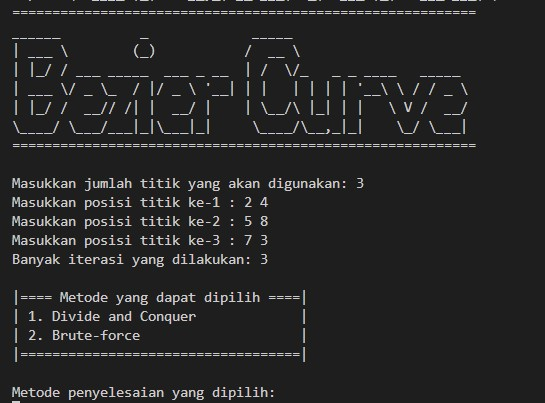

# Tucil2_13522128

> ## **Table of Contents**

- [General Information](#general-information)
- [Requirements](#requirements)
- [How to Run and Compile (Windows)](#how-to-run-and-compile-windows)
- [Screenshot](#screenshot)
- [Program Structure](#program-structure)
- [Author](#author)

## **General Information**
Bézier curve is a smooth curves that are often used in graphic design, animation,
and manufacturing. This curve is created by connecting several control points, which are
determine the shape and direction of the curve.

>Bézier Curve using Bruteforce Algorithm and Divide and Conquer Algorithm

## **Requirements**

To use this program, you will need to install **Python3** (https://www.python.org/downloads/) on the device you are using. You will also need **matplotlib**, **scipy**, **numpy** to be installed before running the program.

- Matplotlib Library

```sh
$ pip install matplotlib
```

- Scipy Library

```sh
$ pip install scipy
```

- Numpy Library

```sh
$ pip install numpy
```

## **How to Run and Compile (Windows)**

### **Setup**

1. Clone this repository <br>

```sh
$ git clone git@github.com:Andhikafdh/Tucil2_13522128_13522160.git
```

2. Open this repository in terminal

### **Compile (optional)**

1. Open terminal in root directory, navigate to 'src' directory. <br>

```sh
$ cd src
```
2. To run the program. <br>

```sh
$ python main.py
```


## **Screenshot**
 

## **Program Structure**

```
.
│   README.md
|
├───doc
|   └───Tucil2_K3_13522128_13522160.pdf
|
└───src
     |
     └───function
     |       └─ __pycache__
     |       |
     |       └─bf_bezier.py
     |         dnc_bezier.py
     |         input_reader.py
     |         visualize_graph.py 
     |
     └───main.py
```

## Author

| **NIM**  |         **Name**          | **Class** |
| :------: | :-----------------------: | :-------: |
| 13522128 | Mohammad Andhika Fadillah |    K03    |
| 13522160 |   Rayhan Ridhar Rahman    |    K03    |
